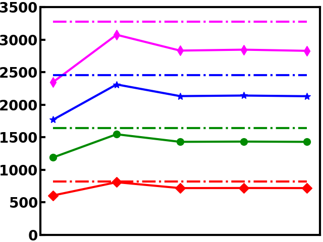
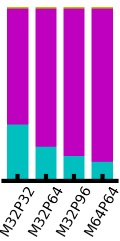

# A Flexible Toolflow for Mapping CNN Models to High-Performance FPGA-based Accelerators

## Overview
This repository implements a complete toolflow for mapping Convolution Neural Network (CNN) models onto FPGAs, including the compiler, hardware architecture, and runtime library. Currently we provide our experimental results for review purpose, and the code will be released in the future.

## Experimental Results
We generate 4 accelerators (M32P32, M32P64, M32P96 and M64P64) and evaluate them with 12 typical CNN models. The results are provided in [experimental results](./experimental_results/). 

Taking [alexnet](./experimental_results/alexnet/) as an example, [layer_info.csv](./experimental_results/alexnet/layer_info.csv) lists all computational layers (Conv, Pool, Add, etc.) and the corresponding parameters (padding, strides, etc.). The inference latency of individual layers for these accelerators are listed in [layer_latency_m32p32.csv](./experimental_results/alexnet/layer_latency_m32p32.csv), [layer_latency_m32p64.csv](./experimental_results/alexnet/layer_latency_m32p64.csv), [layer_latency_m32p96.csv](./experimental_results/alexnet/layer_latency_m32p96.csv), and [layer_latency_m64p64.csv](./experimental_results/alexnet/layer_latency_m64p64.csv). 

You can run the python script like [m32p32.py](./experimental_results/alexnet/m32p32.py) to analyse the performance of corresponding accelerator. The results will saved in [res_m32p32.txt](./experimental_results/alexnet/res_m32p32.txt) and printed:

```
+------------+------------+-------------+--------------------+-----------------+-------------------+---------------+
| layer_name | layer_type | latency(ms) | latency_contrib(%) | operations(MOP) | throughput(GOP/s) | efficiency(%) |
+------------+------------+-------------+--------------------+-----------------+-------------------+---------------+
|   Conv_0   |    Conv    |    0.233    |        4.22        |     140.554     |       604.32      |     73.77     |
| MaxPool_2  |  MaxPool   |    0.023    |        0.42        |      0.000      |        0.00       |      0.00     |
|   Conv_3   |    Conv    |    0.554    |       10.06        |     447.898     |       808.25      |     98.66     |
| MaxPool_5  |  MaxPool   |    0.014    |        0.25        |      0.000      |        0.00       |      0.00     |
|   Conv_6   |    Conv    |    0.313    |        5.67        |     224.281     |       717.61      |     87.60     |
|   Conv_8   |    Conv    |    0.416    |        7.55        |     299.041     |       718.89      |     87.76     |
|  Conv_10   |    Conv    |    0.278    |        5.04        |     199.361     |       717.81      |     87.62     |
| MaxPool_12 |  MaxPool   |    0.006    |        0.10        |      0.000      |        0.00       |      0.00     |
|  Gemm_14   |     Fc     |    2.360    |       42.85        |      75.497     |       31.99       |      3.90     |
|  Gemm_16   |     Fc     |    1.050    |       19.06        |      33.554     |       31.97       |      3.90     |
|  Gemm_18   |     Fc     |    0.263    |        4.77        |      8.389      |       31.93       |      3.90     |
+------------+------------+-------------+--------------------+-----------------+-------------------+---------------+

total_latency: 5.508 ms
conv_latency: 1.793 ms (33%)
other_latency: 3.715 ms (67%)

total_ops: 1.429 GOP
conv_ops: 1.311 GOP (92%)
other_ops: 0.117 GOP (8%)

total_throughput: 259.345 GOP/s
conv_throughput: 731.254 GOP/s
other_throughput: 31.609 GOP/s

FPS: 181.54 Frame/s
```

You can also run [plot.py](./experimental_results/alexnet/plot.py) to compare the performance of these accelerators, which will output two pictures. [throughput.png](./experimental_results/alexnet/throughput.png) shows the throughput of each convolutional layer, and [normalized_latency.png](./experimental_results/alexnet/normalized_latency.png) shows the latency breakdown of each accelerator.

 